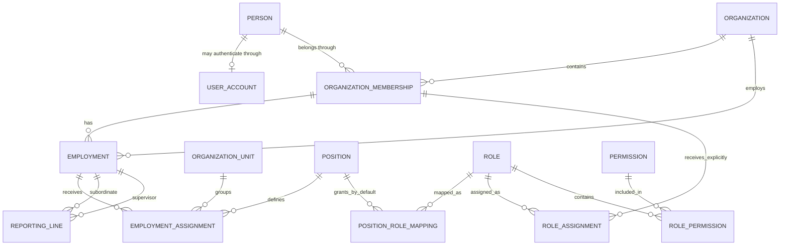
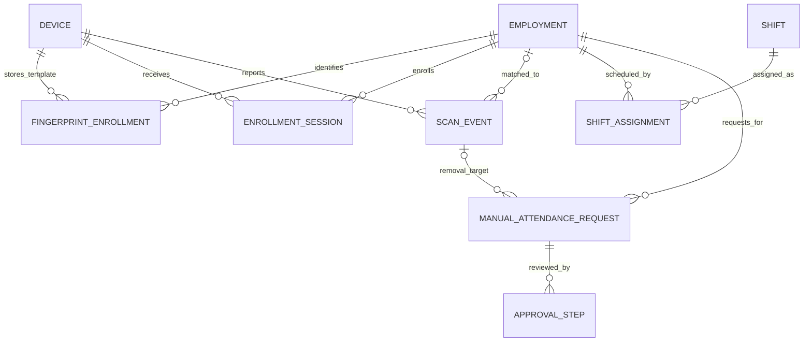

# Database Architecture

This document explains the intent and boundaries of the workforce platform's PostgreSQL data
model. It is the human-readable companion to the implementation; it is not a substitute for
the schema or migration history.

## Sources Of Truth

- [`packages/db/prisma/schema.prisma`](../../packages/db/prisma/schema.prisma) defines the
  current Prisma models, fields, relations, indexes, and referential actions.
- [`packages/db/prisma/migrations`](../../packages/db/prisma/migrations) records how a database
  reaches that state. Committed migrations are immutable after they reach a shared environment.
- This document explains why the model is shaped this way, which invariants are enforced, and
  where application-level rules remain.
- [`docs/development/database-changes.md`](../development/database-changes.md) is the required
  workflow for changing any of the above.

When these disagree, stop and reconcile them in the same pull request. Do not silently treat the
documentation as optional or assume it overrides executable schema history.

## Design Principles

1. **A human, a login, and a job are different things.** `Person`, `UserAccount`,
   `OrganizationMembership`, and `Employment` have separate lifecycles.
2. **Organization structure is assigned to employment.** A person's department, position,
   manager, work location, and shift can change without changing their identity.
3. **History is effective-dated.** Assignments, reporting lines, shifts, and role assignments
   use start/end dates instead of overwriting prior relationships.
4. **Authorization is role-based and scoped.** Positions can supply default roles; explicit role
   assignments handle exceptions and temporary access.
5. **Operational history is retained.** Most employment-related foreign keys use `Restrict` so
   an employment record cannot be removed while attendance, leave, or performance history refers
   to it.
6. **Database and application constraints complement each other.** A foreign key or unique index
   is preferred when PostgreSQL can express an invariant reliably. Cross-row and time-range rules
   must also be validated in application transactions unless a custom migration adds a database
   constraint.

## Identity, Employment, And Access

### Where Data Belongs

| Concern                         | Model                    | Examples                                                           |
| ------------------------------- | ------------------------ | ------------------------------------------------------------------ |
| Human identity                  | `Person`                 | legal/preferred name, personal contact details, date of birth      |
| Authentication                  | `UserAccount`            | login email, password hash, account status, auth version           |
| Login sessions                  | `UserSession`            | token hash, expiry, revocation, session auth version               |
| Access to an organization       | `OrganizationMembership` | invitation/active/suspended state, join/end time                   |
| Contract with an organization   | `Employment`             | employee code, employment type/status, hire/end dates, eligibility |
| Current or historical placement | `EmploymentAssignment`   | department/unit, position, assignment type, location, timezone     |
| Management relationship         | `ReportingLine`          | supervisor, subordinate, line type, validity period                |
| Work schedule                   | `ShiftAssignment`        | shift and effective period for an employment                       |
| Default access by job           | `PositionRoleMapping`    | role and permission scope supplied by a position                   |
| Exceptional access              | `RoleAssignment`         | manual, temporary, system, or materialized position role           |

Do not copy identity fields onto `Employment`, or organization fields onto `Person`. For example,
moving an employee to another department creates or closes an `EmploymentAssignment`; it does not
edit the person. Disabling login changes `UserAccount.status`; ending a contract changes
`Employment.status` and `endedAt`. Either can happen without the other.

### Lifecycle Examples

- **Invite a person:** create/reuse `Person`, create `OrganizationMembership` in `INVITED`, and
  optionally create a `UserAccount` in `PENDING`.
- **Hire:** create `Employment` and an effective `EmploymentAssignment`. Add a `ReportingLine` and
  `ShiftAssignment` when applicable.
- **Transfer or promotion:** close the current assignment by setting `validUntil`, then create the
  replacement. Preserve the old row for historical reporting.
- **Temporary access:** add a `RoleAssignment` with `source = TEMPORARY`, `validFrom`, and
  `validUntil`.
- **Offboard:** end the employment and its open effective-dated relationships, end or suspend the
  membership when appropriate, revoke sessions, and disable the account if the person should no
  longer sign in anywhere.
- **Rehire:** create another `Employment` under the existing membership rather than rewriting the
  ended employment.

### Authorization Resolution

Permissions are global capabilities identified by stable `Permission.key` values. Roles are
organization-owned bundles of those permissions. Effective roles come from two paths:

1. the current `EmploymentAssignment` -> `Position` -> `PositionRoleMapping`; and
2. active, non-revoked `RoleAssignment` rows on the `OrganizationMembership`.

Each mapping or assignment has a `PermissionScope`, such as `SELF`, `DIRECT_REPORTS`,
`ORGANIZATION_UNIT_TREE`, or `ORGANIZATION`. A scoped role answers two separate questions:
**what action is allowed** and **which records it applies to**. Features must check both.

The current portal resolver is
[`apps/portal/src/lib/authorization.ts`](../../apps/portal/src/lib/authorization.ts). It
reloads access on each request and combines position and explicit roles, but its session user
currently contains flattened role and permission keys, not the scope metadata. Until scoped
resource checks are implemented centrally, a permission key alone must not be treated as proof
that organization-wide access is allowed.

`owner` and administrator access are roles, not booleans on `Person`, `UserAccount`, or
`Employment`. An owner is normally supplied by an owner position at `ORGANIZATION` scope. An
administrator can be modeled with an organization role and explicit assignment without changing
the core identity schema.

## Domain Map

| Domain                       | Primary models                                                                                                                             | Notes                                                            |
| ---------------------------- | ------------------------------------------------------------------------------------------------------------------------------------------ | ---------------------------------------------------------------- |
| Identity and tenancy         | `Person`, `UserAccount`, `UserSession`, `Organization`, `OrganizationMembership`                                                           | Separates a human and login from organization access.            |
| Employment structure         | `Employment`, `OrganizationUnit`, `Position`, `EmploymentAssignment`, `ReportingLine`                                                      | Effective-dated organization placement and management hierarchy. |
| Authorization                | `Role`, `Permission`, `RolePermission`, `PositionRoleMapping`, `RoleAssignment`                                                            | Position defaults plus explicit exceptions with scope.           |
| Devices and attendance       | `Device`, `FingerprintEnrollment`, `EnrollmentSession`, `ScanEvent`, `Shift`, `ShiftAssignment`, `ManualAttendanceRequest`, `ApprovalStep` | Device evidence, work schedules, and approval-based corrections. |
| Leave                        | `LeaveTypeConfig`, `LeaveRequest`, `LeaveApprovalStep`, `LeaveBalance`                                                                     | Leave policy, workflow, and annual balances.                     |
| Recruitment                  | `JobPosting`, `JobPostingStep`, `JobApplication`, `JobApplicationStepResponse`                                                             | Configurable application workflows and interview scheduling.     |
| Performance                  | `EmployeeNote`, `PerformanceTemplate`, `PerformanceEvaluation`                                                                             | Employment-linked notes and evaluations.                         |
| Communication and operations | `Announcement`, `Notification`, `AuditLog`, `JobRun`, `ReportExport`, `Holiday`, `CompanySetting`                                          | Cross-feature operational records and configuration.             |

## Attendance And Device Records

- `FingerprintEnrollment` maps an employment to a device-local scanner template. The template ID
  is only unique on a particular device.
- `EnrollmentSession` is a heartbeat-delivered command. `Device.reportedMode` is observed device
  state; desired mode is derived from an active session.
- `ScanEvent` is the immutable ingestion record. `deviceScanSequence` provides per-device
  idempotency when supplied. An unmatched template can leave `employeeId` null.
- Attendance is derived by ordering scan events and approved corrections, then pairing them as
  check-in/check-out events. Corrections are represented by `ManualAttendanceRequest` and their
  sequential `ApprovalStep` records.
- A shift's `startTime` and `endTime` are `HH:mm` strings interpreted in `Shift.timezone`.

See [`attendance-device-api.md`](attendance-device-api.md) for the device transport and heartbeat
contract.

## Other Domain Rules

### Leave

`LeaveTypeConfig` defines policy defaults. `LeaveBalance` is unique per employment, year, and leave
type. A `LeaveRequest` records the requested interval and calculated paid/unpaid totals;
`LeaveApprovalStep` preserves its ordered approval history. Code that updates a balance and
approves a request must do so atomically.

### Recruitment

`JobPostingStep.config` and `JobApplicationStepResponse.answer` are JSON because step definitions
vary by type. Their shape must be validated at the application boundary and documented next to
the owning feature. Job postings are mutable only while in `DRAFT`; publishing changes the status
to `OPEN` and freezes the posting and its step definitions so stored application responses retain
the definition they were submitted against.

Multiple interviewers per step are supported through `JobPostingStep.config.interviewerIds`. When
a candidate schedules an interview, a `JobApplicationStepResponse` is created for the scheduled
time, and `InterviewerBooking` records are created for each interviewer to prevent double-booking.
Availability checks verify that all scheduled interviewers are free. `JobApplication.cvFileData`
stores uploaded CV bytes in PostgreSQL; changes to file size, retention, or external storage are
architectural changes.

### Performance

`PerformanceTemplate.fields` defines a dynamic evaluation form and
`PerformanceEvaluation.responses` stores its answers. The portal must validate responses
against the referenced template version. Templates are currently mutable, so changing fields
after evaluations exist can affect how historical responses are interpreted.

## Enforced Invariants

The schema currently enforces, among other constraints:

- one `UserAccount` per `Person` and globally unique `loginEmail`;
- one membership per person and organization;
- membership and employment organization consistency through the composite
  `(membershipId, organizationId)` foreign key;
- employee codes unique within an organization when present;
- organization-local unique role keys, position codes, and organization-unit codes;
- one fingerprint template ID per device and one enrollment per employment/device pair;
- scan ingestion idempotency for a supplied `(deviceId, deviceScanSequence)`;
- one leave balance per employment/year/leave type; and
- ordered approval-step uniqueness within each request.

## Application-Level Invariants And Known Gaps

The following are not fully guaranteed by the current database schema. Every write path must
validate them inside the same transaction, and a future custom PostgreSQL constraint should be
preferred where practical:

- an employment should have no more than one current `PRIMARY` assignment;
- an employment should have no more than one current `PRIMARY` reporting line;
- assignment units and positions must belong to the employment's organization;
- both sides of a reporting line must belong to the same organization and cannot be the same
  employment;
- role, membership, optional scoped organization unit, and position mapping must belong to the
  same organization;
- effective ranges must be ordered (`validUntil` is after `validFrom`) and should not overlap when
  the relationship type requires exclusivity;
- organization membership, employment, account, and effective-date status must all be considered
  before granting access; and
- permission scope must be enforced against the target resource, not only loaded from the role.

Several older operational models use columns such as `employeeId`, `approverEmployeeId`, and
`interviewerId`. Since the identity/employment migration, these foreign keys point to
`Employment`, not `Person` or `UserAccount`. Prefer `employmentId`-style names for new fields and
rename legacy columns only through a reviewed, data-preserving migration.

Some models (`Device`, `Shift`, `Holiday`, `CompanySetting`, recruitment, and performance
templates) do not yet carry an `organizationId`. They therefore behave as platform-wide data in
the current schema. Do not assume tenant isolation for them. Adding organization ownership is a
separate architectural migration that must include backfill and query-isolation work.

## Dates, Times, And Deletion

- Calendar-only values use PostgreSQL `DATE` where the schema declares `@db.Date`.
- Instants use `DateTime`; applications should write and compare them as UTC instants and convert
  for display using the effective assignment timezone, then organization timezone as fallback.
- Effective intervals are treated as half-open: `validFrom <= now < validUntil`, with null
  `validUntil` meaning open-ended. Shared query helpers live in
  [`apps/portal/src/lib/employment.ts`](../../apps/portal/src/lib/employment.ts).
- `Restrict` is used for history that must not be orphaned, `Cascade` for owned child records, and
  `SetNull` where evidence should survive deletion of its optional actor/match. Review every
  referential action as part of a schema change.
- Prefer status/end-date transitions to hard deletion for people, memberships, employments,
  assignments, and business records with audit value.

## Keeping This Document Current

Update this document in the same pull request whenever a change affects a model's purpose,
ownership, lifecycle, relation, deletion behavior, key invariant, tenant boundary, or data type
semantics. A field-only change still requires an update when another engineer could not safely
infer its meaning from the Prisma field name.

Follow the complete checklist in
[`docs/development/database-changes.md`](../development/database-changes.md).
